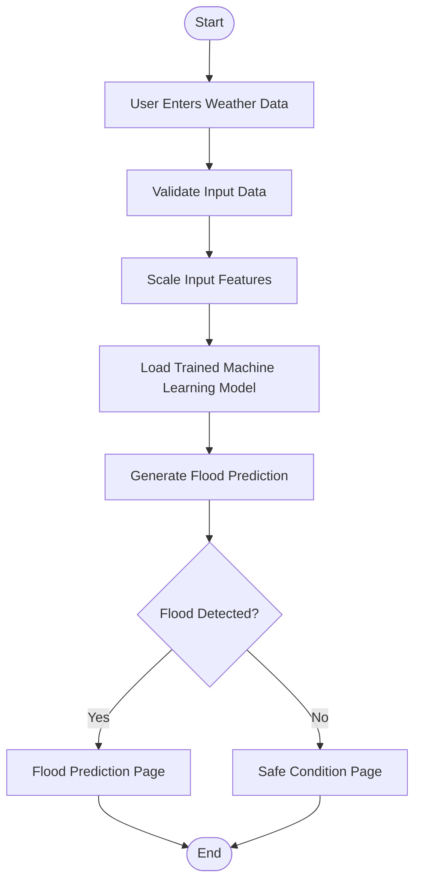

## System Flowchart

The overall workflow of the **Rising Waters Flood Prediction System** is shown below:

```mermaid
flowchart TD

    A([Start]) --> B[User Enters Weather Data]
    B --> C[Validate Input Data]
    C --> D[Scale Input Features]
    D --> E[Load Trained Machine Learning Model]
    E --> F[Generate Flood Prediction]

    F --> G{Flood Detected?}

    G -->|Yes| H[Flood Prediction Page]
    G -->|No| I[Safe Condition Page]

    H --> J([End])
    I --> J([End])
```
