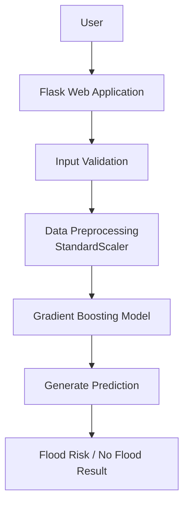

## System Architecture

The overall architecture of the proposed **Rising Waters Flood Prediction System** is illustrated below:

### Architecture Description

The system architecture consists of multiple stages:

1. **User Input:**  
   The user enters weather-related parameters through the web interface.

2. **Flask Web Application:**  
   The Flask application receives user inputs and manages the prediction workflow.

3. **Input Validation:**  
   The system validates the entered values to ensure correct input format.

4. **Data Preprocessing:**  
   The input data is transformed using **StandardScaler** to apply the same scaling process used during model training.

5. **Machine Learning Model:**  
   The processed data is passed to the trained **Gradient Boosting Model** for prediction.

6. **Prediction Output:**  
   The system displays the final result as either **Flood Risk** or **No Flood Condition** on the respective output page.
